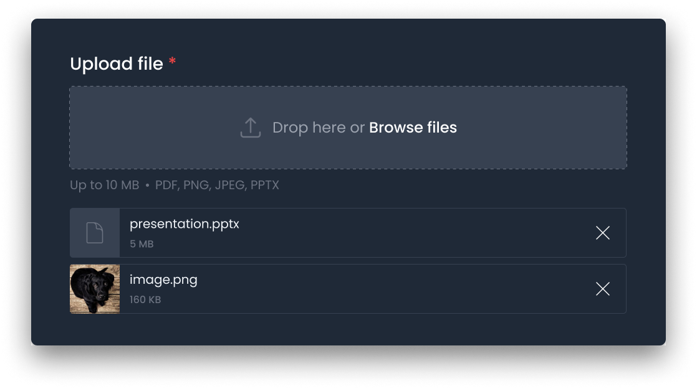

<p align="center"></p>

<p align="center"></p>

<p align="center">
    <a href="https://github.com/dasundev/livewire-dropzone/actions"></a>
    <a href="https://packagist.org/packages/dasundev/livewire-dropzone"></a>
    <a href="https://packagist.org/packages/dasundev/livewire-dropzone"></a>
    <a href="https://packagist.org/packages/dasundev/livewire-dropzone"></a>
</p>

## ✨ Introduction
This dropzone component for Livewire enables easy drag-and-drop file uploads.

> To use this package, you must have [Livewire 3](https://livewire.laravel.com/) installed.

## 📦 Installation
You can install the package via Composer:
```bash
composer require dasundev/livewire-dropzone
```

To install the styles package, use the following command:
```bash
npm i @dasundev/livewire-dropzone-styles
```

Import styles to your project
```scss
/* resources/css/app.css */

@import "@dasundev/livewire-dropzone-styles";
```

## 🎬 Showcase
Now you can use the dropzone component as you like.
```html
<livewire:dropzone
        wire:model="banners"
        :rules="['image','mimes:png,jpeg','max:10420']"
        :multiple="true" />
```

## 🎨 Tailor UI
The dropzone component is entirely customizable. Just publish the view file and make it your own.
```bash
php artisan vendor:publish --tag=livewire-dropzone-views
```

## 📌 Special Note
The Livewire dropzone component uploads files to Livewire's [temporary upload directory](https://livewire.laravel.com/docs/uploads#temporary-upload-directory). To permanently store them, manual action is required. This is where `wire:model` becomes essential. For example, take the `banners` model, which contains each upload as an array containing file paths. You can iterate through this array and store the files according to your preferences.

## 📝 Blog Post
I made a blog post about using the Livewire dropzone to store files permanently. It's perfect for people new to Laravel. You can read the blog post [here](https://www.dasun.dev/blog/how-to-use-livewire-dropzone).

## 🔄 Changelog

Please see [CHANGELOG](CHANGELOG.md) for more information on what has changed recently.

## 🤝 Contributing

Please see [CONTRIBUTING](CONTRIBUTING.md) for details.
